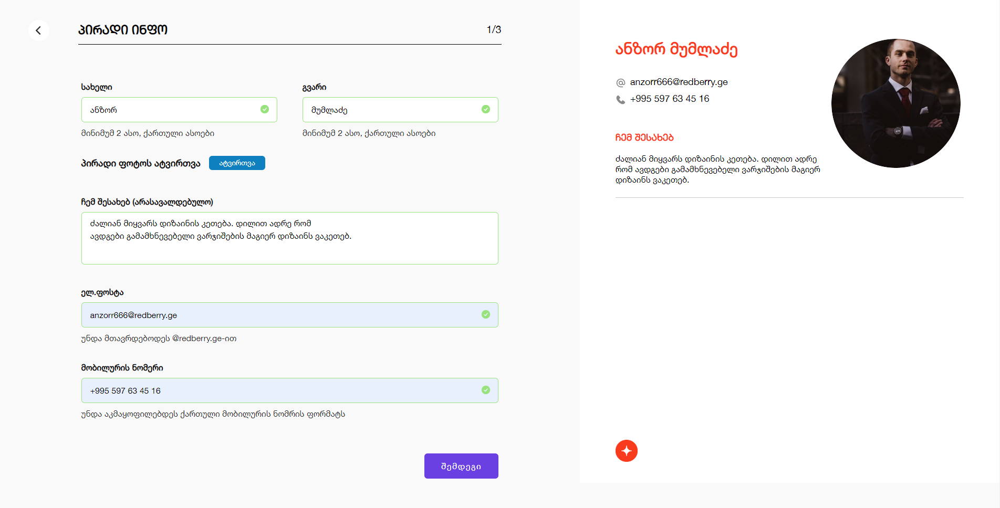

# Redberry - Resume Form app solution

This is a solution to the Redberry coding challenge

## Table of contents

- [Overview](#overview)
  - [The challenge](#the-challenge)
  - [Screenshot](#screenshot)
  - [Links](#links)
- [My process](#my-process)
  - [Built with](#built-with)
- [Author](#author)

## Overview

### The challenge

Users should be able to:

- View the optimal layout for the app depending on their device's screen size
- show if inputed data is vaild for the field
- add additional fields for experience or education
- if page is refreshed filled data must persist
- see resume on the right side of the screen which will update on the user input
- see finished resume on the last page

### Screenshot

### Links

- Solution URL: [Add solution URL here](https://github.com/abramishvilisaba/resume-form)
- Live Site URL: [Add live site URL here](https://sabramishvili-resume-form.netlify.app/)

### Built with

- [Tailwind](https://tailwindcss.com/) - For styles
- [React](https://reactjs.org/) - JS library
- [Formik](https://formik.org/) - For Form Validation
- [React Router](https://reactrouter.com/en/main) - For Routing
- [Axios](https://axios-http.com/docs/intro) - For HTTP Requests

## Author

- github - [saba abramishvili](github.com/abramishvilisaba)
